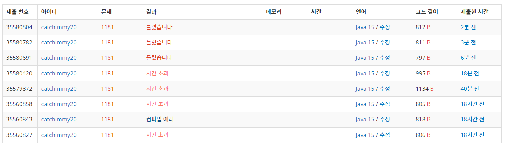

Day 15

*백준 실버 5*


## 문제

알파벳 소문자로 이루어진 N개의 단어가 들어오면 아래와 같은 조건에 따라 정렬하는 프로그램을 작성하시오.

1. 길이가 짧은 것부터
2. 길이가 같으면 사전 순으로

## 입력

첫째 줄에 단어의 개수 N이 주어진다. (1 ≤ N ≤ 20,000) 둘째 줄부터 N개의 줄에 걸쳐 알파벳 소문자로 이루어진 단어가 한 줄에 하나씩 주어진다. 주어지는 문자열의 길이는 50을 넘지 않는다.

## 출력

조건에 따라 정렬하여 단어들을 출력한다. 단, 같은 단어가 여러 번 입력된 경우에는 한 번씩만 출력한다.


### 첫번째 시도 - 선택정렬 후 스왑

```java
package 백준자바;

import java.util.Scanner;

public class 단어정렬_1181 {
	public static void main(String[] args) {
		Scanner sc = new Scanner(System.in);
		// 단어 개수 num개 입력
		int num = sc.nextInt();
		
		// 문자열 배열 생성(레퍼런스 변수만 생성함)
		String str[] = new String[num];
		
		// for문을 통해 배열초기화해줌 
		for(int i=0; i<num; i++) 
			str[i] = sc.next();
		
		int min; // 배열 인덱스의 최소값
		String tmp; // 임시로 저장할 문자열 변수
		
		for(int i=0; i<num-1; i++) {
			// i값으로 인덱스의 최소값 초기화
			min = i;
			
			for(int j=i+1; j<num; j++) {
				// j번 인덱스에 있는 문자열의 길이가 min번 인덱스값에 있는 문자열의 길이보다 작을경우
				if(str[j].length() < str[min].length())
					// 인덱스의 최소값을 j로 바꿈 
					min = j;
				// 문자열의 길이가 같다면
				if(str[j].length() == str[min].length()) {
					// compareTo메소드를 통해 사전순으로 비교
					int res = str[j].compareTo(str[min]);
					
					// res < 0 -> str[j]가 str[min]보다 먼저 나옴
					// res = 0 -> str[j]과 str[min]은 중복되는 문자열
					if(res <= 0)
						min = j;
					
					// res > 0 -> min=i로 변함없기에 다음루프 진행
					else
						continue;
				}
			}
			
			// 두 데이터 교환
			tmp = str[i];
			str[i] = str[min];
			str[min] = tmp;
		}
		
		for(int i=0; i<num; i++) {
			for(int j=i+1; j<num-1; j++) {
				// 중복된 단어일 경우 i값을 증가시키고 안쪽 for문 빠져나옴. 
				if(str[i].equals(str[j])) {
					i++;
					break;
				}
			}
			// 배열 출력
			System.out.println(str[i]);			
		}
		
		sc.close();
	}
}

```


### 예제 입력

```
13
but
i
wont
hesitate
no
more
no
more
it
cannot
wait
im
yours
```

### 예제 출력

```
i
im
it
no
but
more
wait
wont
yours
cannot
hesitate
```


### (1)

첫번째로 코드를 작성할 때에는 단순하게 선택정렬로 앞뒤 순서를 바꾸면 되겠다 싶어 그렇게 했다. (선택정렬은 이 블로그를 많이 참고했다 → []: https://ict-nroo.tistory.com/52)

예제 출력이 제대로 되었지만 코드가 꽤 길었고 채점한 결과 시간초과로 떴다. 다시 생각해도 웃기지만 메인함수가 길어서 그런가해서 메인함수 밖으로 빼서 시도를 해봤지만 결과는 똑같이 시간 초과가 떴다. 인내심의 한계를 느끼고 열심히 구글링하며 다시 뻘짓한 결과 내가 찾고있는 부분을 잘 설명해주신 글을 찾을 수 있었다. 

### (2)

(동일한 문제를 더 잘 풀어주셨다! → []: https://st-lab.tistory.com/112)

양심있게 다 베껴오는건 의미가 없다 싶어 필요한 부분만 가져와서 코드를 작성했다. 
Array.sort()를 단순하게 정렬하는 메소드로만 생각했는데 직접 구현하여 문제에 알맞는 정렬메소드로 만들 수 있었다. 


### 마지막(?) 시도 - Array.sort()이용

```java
package 백준자바;

import java.util.Arrays;
import java.util.Comparator;
import java.util.Scanner;

public class 단어정렬_1181_2 {
	public static void main(String[] args) {
		Scanner sc = new Scanner(System.in);
		// 단어 개수 num개 입력
		int num = sc.nextInt();
		
		// 문자열 배열 생성(레퍼런스 변수만 생성함)
		String str[] = new String[num];

		// for문으로 단어 num개 입력받음
		for(int i=0; i<num; i++) 
			str[i] = sc.next();
		
		//Array.sort 메소드를 구현하여 사용
		Arrays.sort(str, new Comparator<String>() {
			// 두 문자열을 비교 
		    public int compare(String s1, String s2) {
		    	// 문자열의 길이가 같으면
		    	if(s1.length() == s2.length())
		    		// 사전순으로 비교
					return s1.compareTo(s2);
		    	else
		    		// ?)
		    		return s1.length() - s2.length();
		    }
		});
		
		// 중복된 단어 제외하고 출력
		for(int i=0; i<num; i++) {
			for(int j=i+1; j<num-1; j++) {
				if(str[i].equals(str[j])) {
					i++;
					break;
				}
			}
			System.out.println(str[i]);			
		}
		sc.close();
	}
}

```


**?)** compare메소드 이해를 위해 블로그 내용을 잠시 가져왔다. 출처는 (2)에 들어간 블로그 주소와 동일하다. 

------

그리고 compare 메소드 리턴 타입이 왜 int 형이냐고 한다면, 기본적으로 compare 메소드는 3가지 리턴 값에 의해 위치를 바꿀지 결정하게 된다. 3가지 리턴 값이라 하면 다음과 같다.

 \- 양의 정수

 \- 0

 \- 음의 정수

기본적으로 양수일경우 Arrays.sort()에서 정렬 알고리즘에 의해 위치를 바꾸고, 0 이나 음의 정수인 경우는 두 객체의 위치는 바뀌지 않는다. 

예로들어 { 2, 1, 3 } 이라는 배열이 있고, **public int compare(int a1, int a2) { return a1 - a2 }** 가 있다고 가정해보자.

그렇다면 맨 처음 a1 은 2 가 될테고, a2 는 1이 된다. 즉, 2 - 1 = 1 이므로 양수가 반환되기 때문에 a1 과 a2, 즉 2 와 1 의 위치가 서로 바뀌게 된다. 그러면 { 1, 2, 3 } 이 되겠다.

그 다음 a1, a2 는 각각 2 와 3이 될테고, 2 - 3 = -1 이므로 음수가 반환되어 두 객체 2와 3은 위치가 바뀌지 않는다. 

이렇게 compare 메소드는 3가지 반환값에 의해 두 객체(인자)의 우선순위를 판단하고, 이를 정렬알고리즘 안에서 위치를 바꾸거나 그대로 둔다.

------

결과는 동일하게 잘 떴다. 그런데 채점결과...




틀렸다^^  **(╯‵□′)╯︵┻━┻**

참고한 블로그를 다시 찬찬히 봐야겠다^^;;

